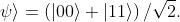

# quantum_computing
<p align="center">
    
    <br>
    
</p>

this repo contains everything i learn about quantum computing and algorithm on quantum computing

## what is aquantum computing

quantum computing is an area of study focused on the development of computer based technologies centered around the principles of [quantum theory](documentation/quantum.md). quantum computing uses a combination of bits to perform specific computational taks. all at much higher efficiency than their classical counterparts. development of quantum computers mark a leap forward in computing capability, with massive performance gains for specifig use cases. for example quantum computing excels at like simulations.

*More information*:
- [what is quantum ?](documentation/quantum.md)
- [atom of computation](documentation/atom_of_computation.md)
- [representing qubit states](documentation/qubit_states.md)


*Perequisites*:
- [basic python](documentation/python_jupyter.md)


## working with quantum
to code any quantum circuit, step
1. **build** design a quantum circuit that represent the problem considering
2. **execute** run a circuits on a backedn, either a system or a simulator
3. **analyze** calculate summary statistic and visualize the result of circuit jobs


simple code to build circuit
```python
circuit = QuantumCircuit(2,2)

# add a H gate on qubit 0
circuit.h(0)

# add a CX(CNOT) gate control qubit 0 and target qubit 1
circuit.cx(0, 1)

# map the quantum measurement to the classical bits
circuit.measure([0, 1], [0,1])
```
explanation

**first**, initialize two qubits in the zero state and two classical bits in the zero state in the quantum circuit called ``circuit``:
```python
circuit = QuantumCircuit(2, 2)
```
**next**, add gates that manipulate th qubits in circuit to frm bell state:



in this state, there is a 50% chance of finding both qubits to have the value 0 and a 50% chance of finding both qubits to have the value 1.

gates:

- ``QuantumCircuit.h(0)``
    
    A handmard gate (h) on qubit 0, which puts it into a superposition state

- ``QuantumCircuit.cx(0, 1)``

    A controlled-NOT operantion (CX) on control qubit 0 and target qubit 1, putting the qubits in an entangled state.
    
- ``QuantumCircuit.measure([0, 1], [0, 1])``
    
    The first argument indexes the qubits; the second argument indexes the classical bits, then the n qubit's measueremtn result ill be stroed in the n classical bit.

```python
circuit.h(0)
circutir.cx(0, 1)
circuit.measure([0, 1], [0, 1])
```
