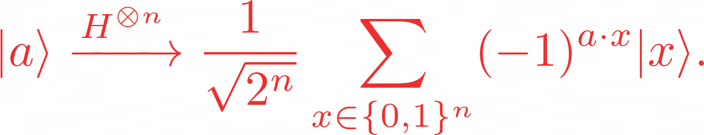
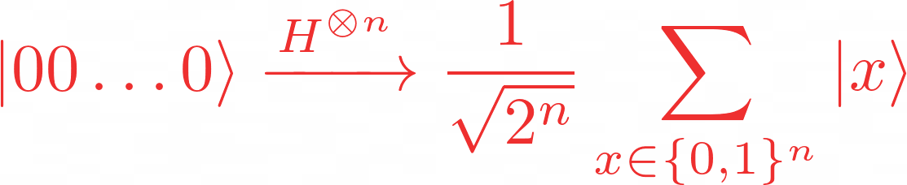
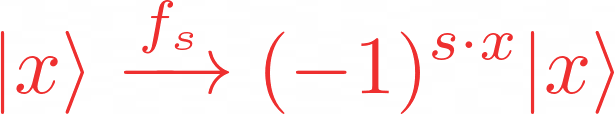
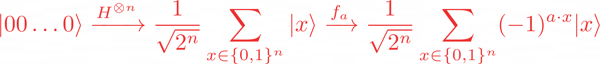
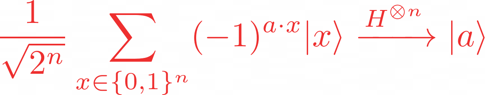

# bernstein-vazirani algorithm

**bernstein-vazirani problem**

we are again given a black-box funtion F, which takes as input string of bits(x) and return either 0 or 1 

f ({x0, x1, x2, ...}) -> 0 or 1 where Xn is 0 or 1

instead of the function being balanced or constant as in the deuthsch-jozsa problem, now the function is guaranteed to return the bitwise product of the input with some string.

## classical solution

classically, the oracle returns;

```
Fs(x) = s . x mod 2
```
given an input x, thus, the hidden bit string s can be revealed by querying the oracle ith the sequence of inputs:

```
input(x) = [
 100...0
 010...0
 001...0
 000...1
]
```
where each query reveals a different bit of __s__, for example, with x = 1000...0, one can obtain the least significatn bit of __s__, with x = 0100...0 we can find the next least significant, and so on. tihs means we would need to call the function Fs(x), n times.

## the quantum solution

using a quantum computer, we can solve this problem with 100% confidence after only one call the function F(x). the quantum bernstein-vazirani algorithm to fund the hidden bit string is very simple:

1. initalize the inputs qubits to the |0>n state, and output qubit to | - >
2. apply hadamard gates to the input register
3. query the oracle
4. apply hadamard gates to the input register
5. measure


to explain the algorithm, let's look more closely at what happerns when we apply a H-gate to each qubit. if e have an n-qibot state, |a>, and apply the H-gates, we will see the transformation



in particular, when start with a quantum register |00...0 > and apply n hadamard gates, we have the familiar quantum superposition



in this case, the phase term (-1)^a-x disappears, since a = 0, and this (-1)^a-x - 1.

the classical oracle f, returns 1 for any input x such that s. x mod 2 = 1, and returns 0 otherwise. if we use the same phase kickback trick from deutsch-jozsa algorithm and act on a qubit in the state | - >, we get the following transformation:



the algorithm to reveal the hidden bit string follows naturally by querying the quantum oracle Fs, with the quantum superposition obtained from the hadamard transformation of |00...0 > namely:



because the inverse ot the __n__ hadamard gates is again the __n__ hadamard gates, we can obtain __a__ by



