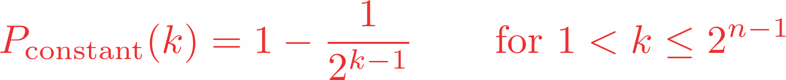

# deutsch jozsa problem

wer are given a hidden boolean function F, which atakes as input a string of bits and returns either 0 or 1, that is:

the property of the given boolean function is that is guaranteed to either be balanced or constant. a constant function returns all 0's or all 1's for any input, while balanced function returns 0's for exactly half of all inputs and 1's for the other half. our task is to determine wheter the given function balanced or constant

## classical solution

classically, in the best case, two queries to the oracle can detrmine if the hidden boolean function, F(x), is balanced: e.g ig we get both ``f(0, 0, 0. ...) -> 0`` and ``f(1, 0, 0, ...) -> 1``, then we know the function is balanced as we have obtained the two different outputs.

in the worst case, if we continue to see the same output for each input we try, we have to check exactly half of all possible inputs plus one in order to be certain that ``f(x)`` is constant. since the total number of possible inputs is ``2^n``, this implies that we need ``2^n-1 + 1`` trials inputs to be certain that ``f(x)`` is constant in the worst case. for examplee, for a 4-bit string, if we checked 8 out of the 16 possible combinations, getting all 0 s. it is still possible that the 9th input rerturns a 1 and ``f(x)`` is balanced. probabilisttically, this is a very unlike event. in fact,if we get the same reuslt continually in succesion, we can express the probability that the function is constant as a function of ``K`` input as

realistically, we could opt to truncate our classical algorithm early, say if we were over ``x%`` confident. but if we want to be 100% confident, we would need to check ``2^n-1 + 1`` inputs

## quantum solution

using quantum computer, we can solve this problem with 100% confidence after only one call function ``f(x)``, provided we have the function f implemented as quantum oracle, which maps the state ``|x>|y>`` to ``|x>|y>⊕ f(x)`` where ``⊕`` is addition module 2. below is the generic circuit for deutsch jozsa algorithm

