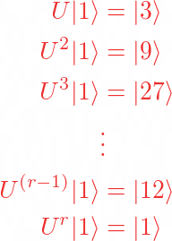
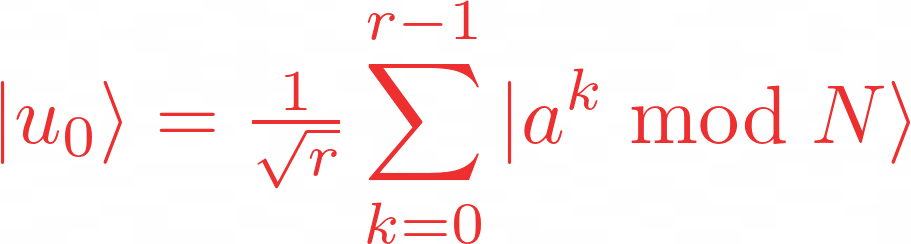
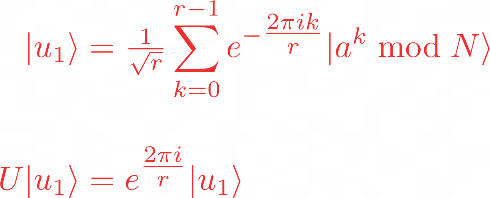
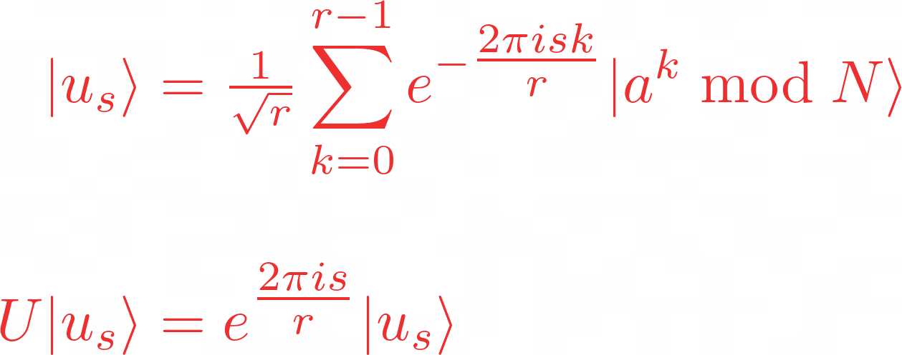
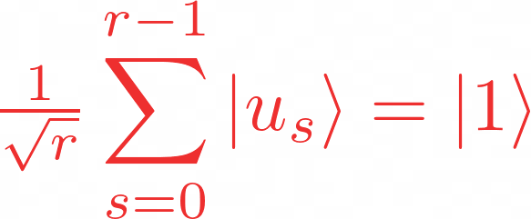
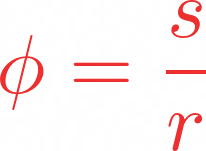

# shor's algorithm

shor's algorithm if famous for factoring integers in polynomial time. since the best known classical lgorithm requres superpolynomial time to factor the product of two promes, the widely used cryptosustem, RSA, relies on factoring being impossible for large enough integers.

shor's algorithm, which actually solves the problem of _period finding_. since a factoring problemcan be turnet into a period finding proble, in polynomial time, an efficient period finding algorithm can be usse to factor integers effeciently too. for now it enough to show if we can compute the period of a^n mod N effeciently, then we can also effeciently factor. since period finding is a worthy problem its own right.

## period finding

periodic function

where _a_ and _N_ are positive integers, _a_ less than _N_, they have no common factors. the period, or order(_r_),is the malles (non-zero) integer such that:

## the solution

shor's solution we to use quantum phase estimation on the unitary operator:

to see how this is helpful, let's work out what an eogenstate of U might look like, if wee started in the state ``|1>``, we can see that each successsive application of U ill multiply the state of our register by _a (mod N)_, and after _r_ application we eill arrive th state ``|1>`` again. for example with _a = 3_ and _N = 35_:

so a superposition of the states in this cycle would be eigen state of _U_

this eigenstate has an eigenvalue of 1, which is'nt very interesting eignestate could be one in which the phase is different for each these computational basis states. specifically, let's look the case in which the phase of the ``kth`` staate is propotional to _K_:

this is an particularly intersting eigenvalues as it contains _r_. in fact. _r_ has to be included to make sure the phase differences between the _r_ computational basis states are equal. this not the only eigenstate whith this behaviour, to generalise this further, we can multiply an integer, _s_, to this phase difference, which will sho up in our eigenvalue

We now have a unique eigenstate for each integer value of  
_s_ where

Very conveniently, if we sum up all these eigenstates, the different phases cancel out all computational basis states except ``|1>``:

Since the computational basis state ``|1>`` is a superposition of these eigenstates, which means if we do QPE on _U_ using the state ``|1>``, we will measure a phase:

Where _s_ is a random integer between 0 and _r − 1_. We finally use the continued fractions algorithm on _ϕ_ to find _r_ . The circuit diagram looks like this (note that this diagram uses Qiskit's qubit ordering convention):

